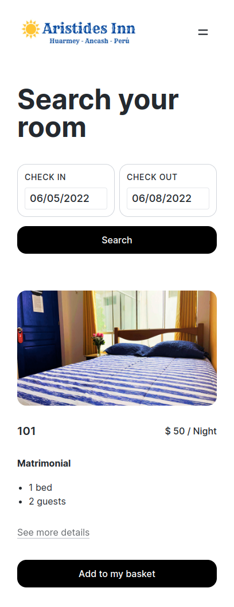
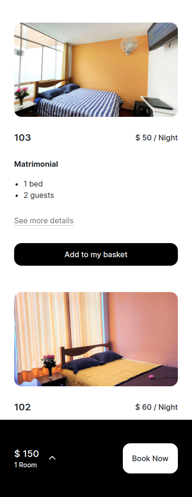
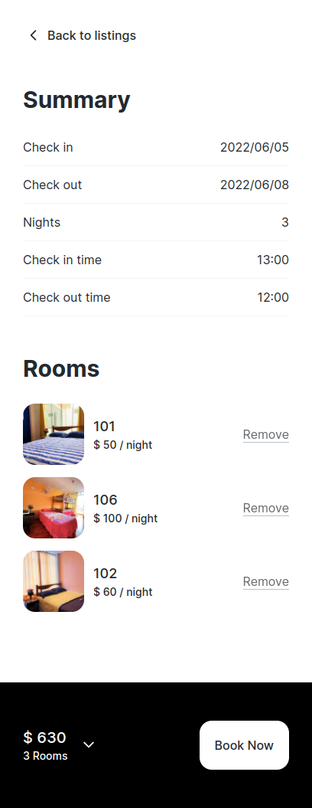

# Tiny Bookings web client for Aristides-Inn Hotel website


Custom Front End integration of the [Tiny-Bookings](https://github.com/d4g0/tiny-bookings) api for the Aristides-Inn Hotel bookings [website](https://www.reservas.aristides-inn.com/en)


This is a particular implementation of a front end integration, a general one with follow soon.

Work in progres. 

## Captures





## Build Setup

```bash
# install dependencies
$ yarn install

# serve with hot reload at localhost:3000
$ yarn dev

# build for production and launch server
$ yarn build
$ yarn start

# generate static project
$ yarn generate
```


